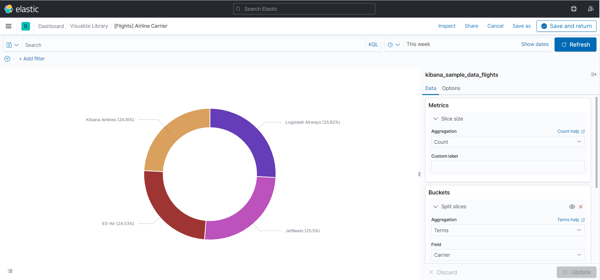
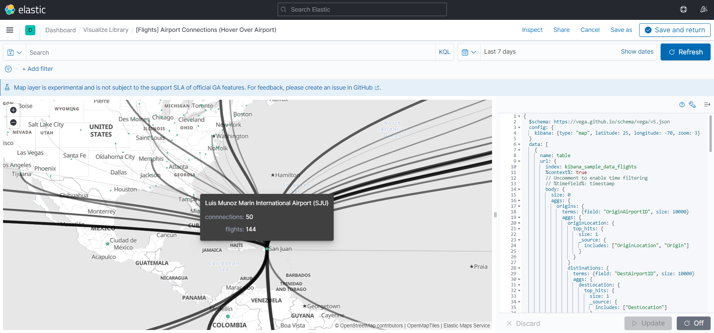

# 基于ELK框架的静态/动态数据可视化系统

本项目源码地址：https://github.com/withoutabc/ELKDATA

本项目所展示的可视化图表均已**单独**保存于`ELKDATA/docs/dashboard/`目录下。

## ELK介绍

### 组成

ELK是`Elasticsearch`、`Logstash`、`Kibana`三大开源框架首字母大写简称。

#### Elasticsearch——搜索引擎

Elasticsearch是Elastic Stack核心的分布式搜索和分析引擎,是一个基于Lucene、分布式、通过Restful方式进行交互的近实时搜索平台框架。Elasticsearch为所有类型的数据提供近乎实时的搜索和分析。无论您是结构化文本还是非结构化文本，数字数据或地理空间数据，Elasticsearch都能以支持快速搜索的方式有效地对其进行存储和索引。

#### Logstash——数据输送

Logstash是免费且开放的服务器端数据处理管道，能够从多个来源采集数据，转换数据，然后将数据发送到指定的“存储库”中。Logstash能够动态地采集、转换和传输数据，不受格式或复杂度的影响。利用Grok从非结构化数据中派生出结构，从IP地址解码出地理坐标，匿名化或排除敏感字段，并简化整体处理过程。

#### Kibana——可视化

Kibana是一个针对Elasticsearch的开源分析及可视化平台，用来搜索、查看交互存储在Elasticsearch索引中的数据。使用Kibana，可以通过各种图表进行高级数据分析及展示。并且可以为 Logstash 和 ElasticSearch 提供的日志分析友好的 Web 界面，可以汇总、分析和搜索重要数据日志。还可以让海量数据更容易理解。它操作简单，基于浏览器的用户界面可以快速创建仪表板（dashboard）实时显示Elasticsearch查询动态。

## ELK框架用于数据可视化的优势

1. **统一的数据源**：ELK整合了Elasticsearch、Logstash和Kibana，可以通过Logstash将各种数据源的数据进行收集和处理，然后通过Elasticsearch进行索引和存储。这意味着可以从不同的数据源中获取数据，并将其统一存储在一个集中的位置，方便进行统一的数据可视化。
2. **多样化的可视化选项**：Kibana作为ELK的可视化工具，提供了丰富多样的图表和仪表盘选项。你可以通过Kibana创建各种类型的图表（如柱状图、折线图、饼图等）、地图、数据表格等，以及自定义仪表盘，来展示和分析数据。
3. **实时数据展示**：ELK具备实时处理和分析日志数据的能力。你可以实时查看最新的数据，并将其实时展示在可视化界面上。
4. **大数据支持**：ELK基于分布式架构，可以处理大规模的数据集。Elasticsearch的分片和副本机制保证了系统的高性能和高可用性，在处理大量数据时仍能保持较高的响应速度。

## 数据可视化

### 静态数据可视化——航班信息

#### 数据源

- 来源：从`Kibana`中下载的飞机航班数据样例。
- 复杂性：共有**2000+**行，**20+**列数据。

（数据源文件在项目`ELKDATA/data/static/`目录下）

#### 数据介绍

数据包含了每个航班的出发时间、平均票价、航空公司、起始地城市、起始地国家、目的地城市、目的地国家、星期、出发机场（及ID）、目标机场（及ID）、出发地/目的地天气、航程（公里+英里单位）、是否取消、是否延迟、延迟类型、航班号、航行时间、出发地/目的地经纬度坐标等信息。

#### 部署

这里用`docker compose`实现`Elasticsearch`和`Kibana`的快速部署。

```yml
# 提前创建容器网络
# docker network create elk

version: "2"
services:
  elasticsearch:
    image: elasticsearch:7.13.1
    container_name: elasticsearch
    volumes:
      - "./elasticsearch_data:/bitnami/elasticsearch"
    ports:
      - "9200:9200"
      - "9300:9300"
    environment:
      - TZ=Asia/Shanghai
      - discovery.type=single-node
      - "ES_JAVA_OPTS=-Xms512m -Xmx512m"
    privileged: true
    ulimits:
      nofile:
        soft: 65536
        hard: 65536
    networks:
      - elk
  kibana:
    image: kibana:7.13.1
    container_name: kibana
    environment:
      - elasticsearch.hosts=http://elasticsearch:9200
      - TZ=Asia/Shanghai
    restart: always
    ports:
      - "5601:5601"
    volumes:
      - "./kibana_data:/bitnami/kibana"
    depends_on:
      - elasticsearch
    networks:
      - elk
networks:
  elk:
    external: true
```

部署完成之后导入数据，在`Discover`界面查看：

可以直观地看到每个时间段的记录数。

#### 数据可视化

这里先展示一下最终的整体效果：

接下来选取几个有代表性地简单说明：

1. **平均票价**

2. **航空公司占比情况**

   - 这里都是虚拟的航空公司

   

3. **航班数和平均票价情况**

4. **航班延迟和取消情况**

   - 竖线表示取消,蓝色逗号表示延迟率

   

5. **飞机延误类型统计**

6. **起初地和目的地对比**

7. **机场间的联系**

8. **航班起始地和目的地地图**

- 以上所有图表均可以灵活调节时间范围，并随着时间推移自动更新。

- 访问地址: http://49.7.114.49:5601/app/dashboards#/view/7adfa750-4c81-11e8-b3d7-01146121b73d (如访问不正常请无视,部署不稳定)


### 动态数据可视化——Web应用的后台数据

#### 数据源

由于Web应用与本赛道主题关系不大，我只用`golang`模拟了几个接口，并简单地编写了前端界面。这里只做简单介绍：

|   路径   |             作用              |               备注               |
| :------: | :---------------------------: | :------------------------------: |
| `/visit` |          进入web界面          |    请求此接口后自动请求`/ip`     |
|  `/ip`   |      获取登录主机的地址       | 有时请求信息速度较慢，请耐心等待 |
| `/slow`  | 模拟耗时较长的业务，睡500毫秒 |  点击`/visit`界面的按钮即可访问  |

我已用Docker将代码打包成镜像部署在服务器上，评委若感兴趣可以访问：http://49.7.114.49:5888/visit 

您的访问**将会以日志形式记录，并被ELK框架读取分析**。

换句话说，**这里的数据来自对接口的访问**。

#### 数据介绍

一共有三类日志格式：

1. `level`+`msg`+`time`：记录请求过程中产生的错误信息（msg格式不固定，可能是任何信息）。

   ```log
   {"level":"error","msg":"请求失败:Get \"http://ip-api.com/json/125.86.165.54?fields=61439\u0026lang=zh-CN\": read tcp 192.168.128.2:40052-\u003e208.95.112.1:80: read: connection timed out","time":"2023-09-12T18:41:40+08:00"}
   ```

2. `level`+`msg`+`time`，`msg`含有`country`+`region`+`city`+`latitude`+`longitude`：记录客户端地址。

   ```log
   {"level":"info","msg":"country:中国,region:河南,city:郑州市,latitude:34.747200,longitude:113.625000","time":"2023-09-15T22:13:27+08:00"}
   ```

3. `timestamp`+`status_code`+`client_ip`+`latency`+`method`+`path`：记录请求信息和响应结果。

   ```log
   timestamp:2023-09-12 18:24:06,status_code:200,client_ip:125.86.165.54,latency:5.672637623s,method:GET,path:/ip
   timestamp:2023-09-12 18:24:14,status_code:200,client_ip:125.86.165.54,latency:351.117µs,method:GET,path:/visit
   ```

- 以上字段信息的获取都借助了一些框架或API接口，这里不赘述。

#### 数据收集

基于之前的静态数据可视化（`elasticsearch`+`kibana`），现在额外部署`logstash`，用于不断将日志信息收集处理并发送至`elasticsearch`中。

```yml
# docker-compose.yml中添加  
  logstash:
    image: docker.elastic.co/logstash/logstash:7.13.1
    container_name: logstash
    volumes:
      - "./logstash.conf:/usr/share/logstash/pipeline/logstash.conf"
      - "./elk_data/log/:/home/withoutabc/elk/elk_data/log/"
      - "./jdbc_driver/mysql-connector-java-8.0.26.jar:/jdbc_driver/mysql-connector-java-8.0.26.jar"
    environment:
      - "XPACK_MONITORING_ENABLED=false"
      - TZ=Asia/Shanghai
    depends_on:
      - elasticsearch
    networks:
      - elk
```

其中，`"./logstash.conf:/usr/share/logstash/pipeline/logstash.conf"`用于将宿主机上的`logstash`配置文件挂载到容器中。

```ruby
# logstash.conf
input {
  file {
    path => "/home/withoutabc/elk/elk_data/log/*.log"
    start_position => "beginning"
    sincedb_path => "/dev/null"
    tags => ["file"]
  }
}

filter {
  if "client_ip" in [message] {
    grok {
      match => { "message" => "timestamp:%{TIMESTAMP_ISO8601:timestamp},status_code:%{NUMBER:status_code},client_ip:%{IP:client_ip},latency:%{NUMBER:latency_value}%{DATA:latency_unit},method:%{WORD:method},path:%{URIPATH:url_path}" }
    }
    date {
        match => [ "timestamp", "yyyy-MM-dd HH:mm:ss" ]
        target => "@timestamp"
    }
    mutate {
      add_field => {
        "index_name" => "visit"
      }
    }
  } else if "country" in [message] {
    grok {
    match => { "message" => "{\"level\":\"%{WORD:level}\",\"msg\":\"country:%{DATA:country},region:%{DATA:region},city:%{DATA:city},latitude:%{NUMBER:latitude},longitude:%{NUMBER:longitude}\",\"time\":\"%{TIMESTAMP_ISO8601:timestamp}\"}" }

    }
    date {
        match => [ "timestamp", "yyyy-MM-dd'T'HH:mm:ssZ" ]
        target => "@timestamp"
    }
    mutate {
      add_field => {
        "index_name" => "ip"
      }
    }
    mutate {
    convert => {
      "latitude" => "float"
      "longitude" => "float"
    }
  }

    mutate {
    add_field => {
      "location" => "%{[latitude]},%{[longitude]}"
    }
  }
  } else if "level" in [message] and "country" not in [message] {
    grok {
        match => { "message" => "{\"level\":\"%{WORD:level}\",\"msg\":\"%{GREEDYDATA:msg}\",\"time\":\"%{TIMESTAMP_ISO8601:timestamp}\"}" }

        }
        date {
            match => [ "timestamp", "yyyy-MM-dd'T'HH:mm:ssZ" ]
            target => "@timestamp"
        }
        mutate {
          add_field => {
            "index_name" => "log"
          }
        }
  } else {
    drop {}
  }
}

output {
    if "file" in [tags] {
      elasticsearch {
          hosts => ["elasticsearch:9200"]
          index => "%{index_name}"
        }
    }
    stdout {
            codec => rubydebug
    }
}
```

- 配置文件使用`ruby`语言进行逻辑处理。
- 通过对不同格式的日志信息解析，将数据导入`elasticsearch`。
- 用3个索引分别存储了以上三种格式的日志：`log`，`ip`，`visit`。

现在访问`Kibana`界面，并`Create index pattern`，可以在`Discover`中看到数据关于日期的分布。

1. `log`
2. `ip`
3. `visit`

#### 数据可视化

用`Kibana`的`Visualization`进行数据可视化，虽然无法短时间获取大量数据，但我会尽量描述清楚它们的作用。

1. **监测错误日志**
   - 横轴：时间戳，纵轴：日志记录（过滤掉**不是错误**的日志记录）
   - 作用：方便开发人员观测错误日志数的走向和趋势、及时排查问题。

2. **错误日志数**

   - 和上一项搭配，统计过去24小时产生的错误日志。
   - 作用：直观清晰地反映是否有错误待排查。

3. **访问来源前10名**
   - 作用：了解用户受众、根据用户偏好改进内容、区域的市场扩展

4. **请求响应状态码**
   - 绿色表示200，黄色表示304，红色表示404。
   - 作用：分析请求响应情况。
   - 这里只模拟了三种状态码，实际场景会有更多（400，500等等）
5.  **请求路径统计**
   - 用不同颜色表示不同请求路径（接口）。
   - 作用：分析不同接口的调用情况，有利于合理分配服务器资源。
   - 这里接口之间存在相互调用的关系，业务场景中效果更明显，仅做一个参考。
6. **请求响应时间**
   - 作用：监测响应时间，及时优化响应较慢的接口。
   - 对**秒**级别的进行计数
   - 对**毫秒**级别中，高于500ms的进行计数
7. **访问来源热力图**
   - 作用：直观分析受众分布和热点地区

- 用一个`Dashboard`汇集所有图表，给每个图表设置了`Customize time range`，用于区分时间范围。


#### 总结

以上信息和图表**都能够实时动态收集信息并绘图**，这是由`logstash`**实时收集信息**的特性决定的。若评委老师访问http://49.7.114.49:5888/visit 后想观测自己的访问记录是否被收集，可以打开 http://49.7.114.49:5601/app/dashboards#/view/a2381460-545d-11ee-a0a4-237297b5e6c4

**如果不能正常打开请无视，部署不稳定**。

用鼠标经过图像时会显示数据，或许这可以帮助您更好地确认日志是否实时记录。

## 结语

数据可视化的意义在于将复杂的数据转化为直观、易于理解的图形或图表形式。它有以下几个重要的作用：

1. **传达信息**：通过可视化，数据的含义和关系可以更清晰地传达给观众或用户。图表和图形可以帮助人们更快速地理解数据背后的趋势、模式和异常。
2. **探索数据**：可视化可以帮助我们发现数据中的隐藏模式、关联和趋势。通过观察图表和图形，我们可以获得对数据的更深入洞察，从而指导进一步的分析和决策。
3. **提供决策依据**：数据可视化有助于支持决策过程。通过直观的视觉呈现，决策者可以更好地理解数据背后的洞察，并做出基于数据的明智决策。
4. **交流和共享**：数据可视化是一种通用的语言，能够跨越不同背景和专业领域的人们之间进行交流和共享。通过共享可视化图表，人们可以更好地理解和讨论数据，促进合作和知识共享。